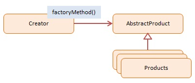

# Factory Method
> Informação sobre este padrão.

## Classificação
```sh
Padrão de Criação
```

## Intenção
Definir de forma que o modo um centro de criação para um tipo d eobjeto no qual nao te conhecimento do tipo concreto para ser usado.

## Motivações
Evita acoplamento
Principio de responsabilidade unica
Principio aberto/fechado


## Aplicabilidade
Redução de codigo que constrói componentes. Permitir a possibilidade que qualquer pessoa possa substituir um método, alem de estender o mesmo.
Utilizado quando tem que lidar com grandes objetos que usam muitos recursos.

## Estrutura

     
## Participantes
* Gerador - Factory
    * Fabrica objeto cria novos produtos
    * Implementa fabrica de metodos no quais retorna produtos recém-criados
* Produto abstrato - não usa em javascript
    * Declara interface para produtos
* Produto Concreto - animals
    * Produto esta sendo criado
    * Todos os produtos podem suportar a mesma interface(metodos e propriedades)

## Codigo de demonstração
><a style="text-decoration: none; color: #f0f0f0f0" href="https://github.com/hebertbritto/design_patterns/blob/main/factorymethod/factoryMethod.js">Ir para o exemplo</a>