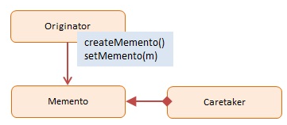

# Memento
> Informação sobre este padrão comportamental.

## Classificação
```sh
Padrão Comportamental
```

## Intenção
Permitir uma forma de que possa capturar e armazenar o estado de um objeto, sendo possivel ser restaurado para o estado original.

## Motivações
Simplificação de codigo do originador, mantendo um historico de estado.
Produzir snapshots dos objetos de estado sem violar seus encapsulamentos.

## Aplicabilidade
Permite gerar copias completas do estado de um objeto, até campos privados, e armazená-los separadamente do objeto.
Torna o próprio objeto responsável por gerar uma copia de seu estado. Nenhum outro objeto conseguirá ver, tornando-se protegios e seguros.

## Estrutura

     
## Participantes
* Originador - Newsletter
    * Implementa uma interface para criar a restaurar dados de si mesmo
    * O estado do objeto é temporario sendo salvo e restaurado
* Memento - representado por JSON Newsletter
    * O estado interno do objeto Originador, esta armazenado.
* CareTaker
    * Responsável por armazernar as lembranças geradas
    * Apenas em um local definido; nao é possivel fazer alterações nos dados.

## Codigo de demonstração
><a style="text-decoration: none; color: #f0f0f0f0" href="https://github.com/hebertbritto/design_patterns/blob/main/memento/memento.js">Ir para o exemplo</a>
