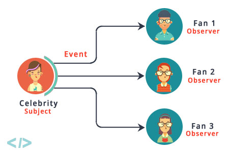

# Observer
> Informação sobre este padrão comportamental.

## Classificação
```sh
Padrão Comportamental
```

## Intenção
Deliberar tais formas que haja possibilidade de um objeto agregador notificar e também atualizar de forma automática outros objetos agregados dependentes se houver uma ação de alteração no estado do objeto agregador.

## Motivações
Principios aberto/fechado, pode estabelecer relações entre objetos em tempo de execução

## Aplicabilidade
Costuma-se usar quando precisa que alguns objetos em seu sistema devem oberservar outros, porém com tempo pré-definido ou por um curto período.
Assinaturas são dinâmicas, portanto os assinantes podem entrar ou sair da lista sempre que houver necessidade.

## Estrutura

     
## Participantes
* Assunto - No codigo
    * Mantpem lista de observadores. Qualquer numero de objetos Observer tem a capicidade de observar o assunto
    * Faz a implementação na qual uma interface o permite que objetos observadores assinem ou cancelem
    * Faz notificações para os observadores que estão assinados.
* Observadores - No codigo
    * Há uma assinatura, em função disto pode ser invocada o Assunto, quando ocorrer uma ação de evento.

## Codigo de demonstração
<!-- ><a style="text-decoration: none; color: #f0f0f0f0" href="https://github.com/hebertbritto/design_patterns/blob/main/state/state.js">Ir para o exemplo</a> -->
