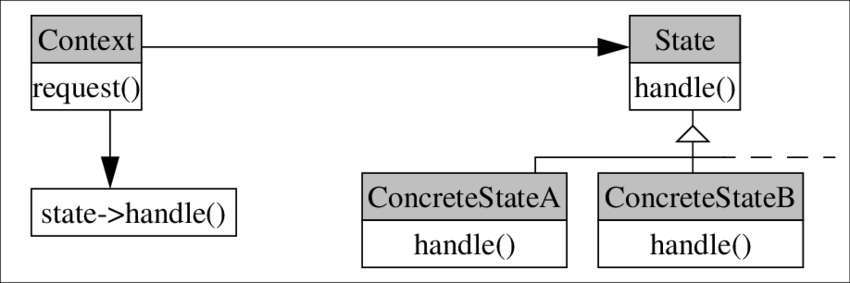

# State
> Informação sobre este padrão comportamental.

## Classificação
```sh
Padrão Comportamental
```

## Intenção
Sua intenção é definir que pode haver uma possibilidade de mudança dentro de um comportamento, e quando isso ocorrer ele mudará para as informações que foram alteradas.

## Motivações
Fácil utilização, simplificação de codigo e boa legibilidade

## Aplicabilidade
Cada objeto terá um conjunto própio de propriedades(STATE) e metodos(regra para transição de estado aceitável). Como são frenquemente implementadas com o padrão de estado definido, seus objetos de estado serão alterados por outro quando ocorrer uma mudança de dados no estado.

## Estrutura

     
## Participantes
* Contexto - Alterador de cores
    * Deixar a interface oferecer suporte a clientes do serviço
    * Mantém a referencia de um objeto de estado no qual demonstra o estado atual
    * Permissão para que oe stado possam fazer alterações de um estado diferente do atual
* Estado - em código
    * Encapsulamento de estados e associados a eles.

## Codigo de demonstração
><a style="text-decoration: none" href="https://github.com/hebertbritto/design_patterns/blob/main/state/state.js">Ir para o exemplo</a>
