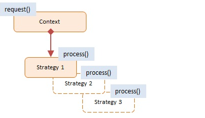

# Strategy
> Informação sobre este padrão comportamental.

## Classificação
```sh
Padrão Comportamental
```

## Intenção
Definir tal objeto que possua determinados comportamentos, gerem variações intercambiais dependendo de outros objetos clientes que os controlam.

## Motivações
Implementar detalhes de algoritmos de um codigo que o usa
Susbstituir herança por composidade
Troca de algoritmos em tempo de execução

## Aplicabilidade
Alteração idiretamentamente de um comportamento de um objeto no tempo em que esta sendo executado, os associando-o a defirentes sub-objetos no qual pode fazer sbtarefas especificas de formas diferentes.
Isolamento de código, dados interno e as dependências de varios outros algortmos restantes. Obtenção de interface simples.

## Estrutura

     
## Participantes
* Context
    * Guarda a referência para o atual objeto.
    * Permite clientes alterar estrategias
* Strategy - representado por JSON Newsletter
    * implementa algoritmo usando estrategia deinterface
    
## Codigo de demonstração
><a style="text-decoration: none; color: #f0f0f0f0" href="https://github.com/hebertbritto/design_patterns/blob/main/strategy/strategy.js">Ir para o exemplo</a>